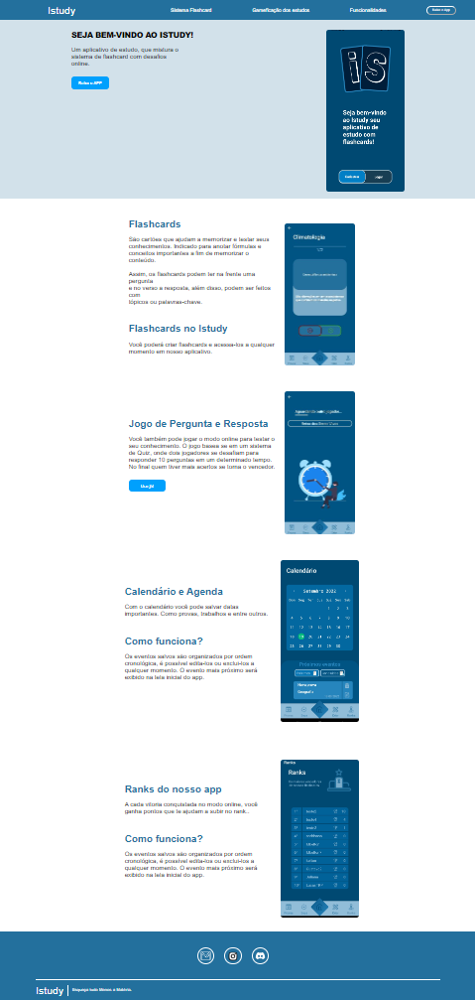

<h1 align="center">LandingPage IStudy</h1>

Este projeto foi uma landing page apresentando o meu TCC no terceiro ano do ensino médio integrado a desenvolvimento de sistemas
  

### 🔗 Links:
<a href="https://github.com/LucasTKP/IStudyWeb">Projeto IStudyWeb</a> 
<a href="https://istudyy.vercel.app/">Deploy</a> 

 
 

### 💻 Projeto:

Este projeto consiste em uma landing page apresentando o meu TCC.

   

### 🎯 Objetivo:

Criar um site que apresente meu TCC.

   

### ⚙️ Tecnologias:

- Html
- Css

     

### 📷 Tela principal:

  

 
